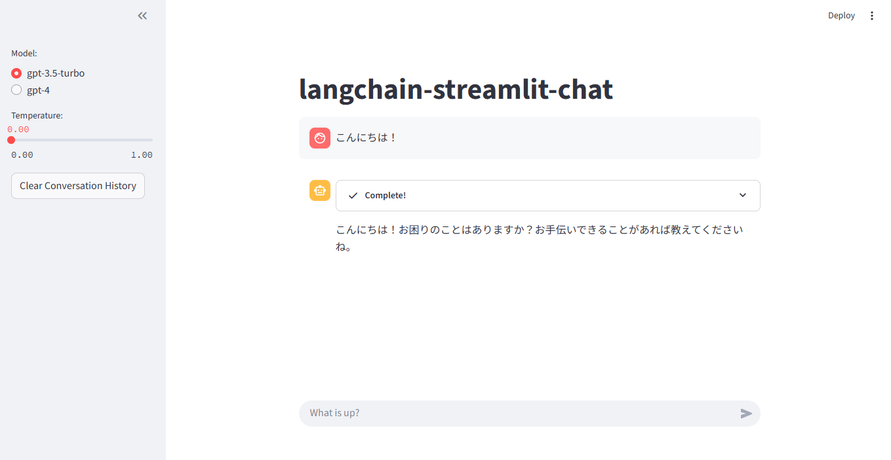

# sample-simple-chatapp



## function

- GUI上でモデルの調整
  - 使用するモデル、パラメータ（temperature）の値を変更可能。
  - 変更しても会話履歴は引き継がれる。
- 会話履歴の削除
  - [Clear Conversation History]ボタンから会話履歴を削除可能。
  - GUIから会話履歴が消えるだけでなく、エージェントで設定しているmemoryも初期化する。
- Agentsを用いたチャット機能
  - よくあるAIと対話するチャット機能。
  - 質問の内容に応じて、下記のAgentsを使用して回答を生成する。
    - DuckDuckGo: Web検索
    - wikipedia: Wiki検索

## environment setting

```bash
git clone https://github.com/sakagami0615/sample-simple-chatapp.git
```

```bash
poetry update
```

## run app

```bash
poetry run poetry run streamlit run app.py --server.port 8080
```

or

```bash
make run
```

## source code

| source | doc |
| --- | --- |
| app.py | アプリ本体 |
| setting.py | 定数&環境変数設定 |
| common/create_logger.py | ロガー作成処理 |
| llm/agent.py | エージェント作成処理 |
| llm/datatype.py | 自作データ型定義 |

## appendix: static analysis (ruff)

```bash
# linter & formatter
poetry run ruff check .
poetry run ruff format . --check

# linter & formatter (auto fix)
poetry run ruff check . --fix
poetry run ruff format .
```
